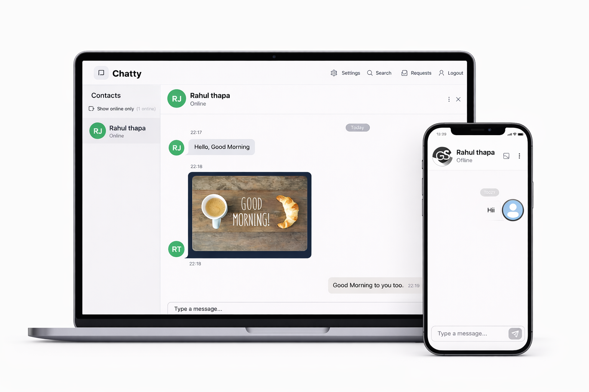

# Message. A WhatsApp like Chat App

<p align="center">
  
</p>

# 🌐 Live Preview

🔗 Deployed App:
https://store-frontend-orcin.vercel.app/

⚠️ Notes:

Backend is hosted on Render free tier, so initial load may be slow

## 🔧 Local Setup Guide

Follow the steps below to run the project locally.

---

## 📁 Environment Variables Setup

Create a `.env` file in ** frontend ** directories.

---

## 🔧 Frontend `.env`

```env
MONGODB_URI=xxx
PORT=5001 
JWT_SECRET= xxx
NODE_ENV=development
CLOUDINARY_CLOUD_NAME=xxx
CLOUDINARY_API_KEY= xxx
CLOUDINARY_API_SECRET=xxx
EMAIL_PASS = xxx
EMAIL_USER = xxx
```
Where to get them:
<p>
  MongoDB Atlas → https://www.mongodb.com/products/platform/atlas-database
</p>
<p>
JWT_KEY → https://jwtsecrets.com/#generator  
</p>
<p>
CLOUDINARY_CLOUD_NAME,CLOUDINARY_API_KEY ,CLOUDINARY_API_SECRET → https://cloudinary.com/
</p>

<p>
  GMAIL_PASS, GMAIL_USER → from Gmail
</p>


# 📦 Install Dependencies

Run this command inside both frontend and backend folders:
```
npm install
```

# ▶️ Run the Project

Start both servers simultaneously using command:
```
npm run dev
```
